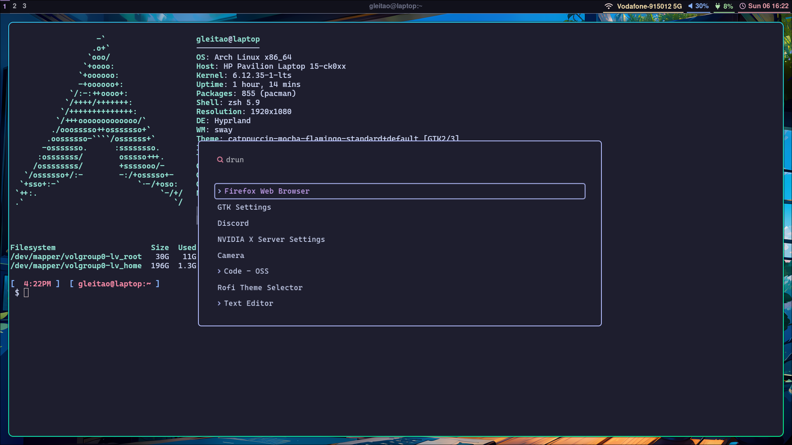

# 🛠 Dotfiles Setup

This repository has all the necessary material to automate the installation and configuration of a customized Arch Linux desktop environment using [Hyprland](https://github.com/hyprwm/Hyprland), along with theming, terminal, status bar, and app launcher preferences.

## 📋 Setup Overview

The script `setup.sh` performs the following tasks:

* Installs required packages (via `yay`)
* Stows and applies personal configurations using GNU `stow`
* Sets up wallpaper, terminal, GTK themes, status bar, application launcher, lockscreen, and Hyprland configuration
* Applies visual theming using [Catppuccin](https://github.com/catppuccin)

---

## 🧰 Requirements

Make sure you have the following tools and prerequisites installed:

* [yay](https://github.com/Jguer/yay): AUR helper for package management
* [stow](https://www.gnu.org/software/stow/): For managing dotfiles via symlinks
* A Hyprland-compatible Wayland environment
* A working internet connection

---

## 📂 Directory Structure

Your dotfiles repository should include the following folders:

```
.
├── backgrounds/
├── hyprlock/
├── hyprmocha/
├── hyprpaper/
├── kitty/
├── waybar/
├── wofi/
├── .zshrc
├── zsh_setup.sh
├── setup.sh
└── hyprland.conf
```

---

## 🚀 What the Script Does

### 1. **Stow & Install Base Tools**

```bash
yay -Sy stow
```

Installs GNU `stow` to manage symlinks of your configuration files.

### 2. **Wallpaper Setup**

```bash
yay -Sy hyprpaper
stow hyprpaper
stow backgrounds
```

Installs `hyprpaper` and applies wallpaper-related configuration using `stow`.

### 3. **Kitty Terminal Configuration**

```bash
stow kitty
./zsh_setup.sh
```

Applies terminal settings and runs a separate ZSH setup script.

### 4. **Waybar Status Bar Configuration**

```bash
killall waybar
rm ~/.config/waybar/*
stow waybar
```

Kills any running Waybar instances, clears old configs, and applies your custom config.

### 5. **GTK Application Theming**

```bash
yay -Sy nwg-look
yay -Sy catppuccin-gtk-theme-mocha
nwg-look
```

Installs a GTK theme selector and Catppuccin Mocha GTK theme. Launches `nwg-look` for manual theme selection.

### 6. **Wofi App Launcher Setup**

```bash
stow wofi
```

Applies configuration for Wofi, a Wayland-native application launcher.

### 7. **Hyprlock Lockscreen Setup**

```bash
sudo rm -rf ~/.config/hypr/hyprlock.conf
stow hyprlock
stow hyprmocha
```

Removes old Hyprlock config, applies new settings and Catppuccin-inspired themes.

### 8. **Hyprland Configuration**

```bash
sudo rm ~/.config/hypr/hyprland.conf
cp hyprland.conf ~/.config/hypr/
```

Applies the main Hyprland configuration file directly.

### 9. **Reboot**

```bash
reboot
```

Reboots the system to apply all changes.

---

## 🖼 Screenshot

This is what it looks like:



---

## 🧑 Author

Created by [Guilherme Leitão](https://github.com/your-username)
Feel free to fork and customize for your own environment!

---

## 📄 License

MIT License.
See [LICENSE](./LICENSE) for more details.
