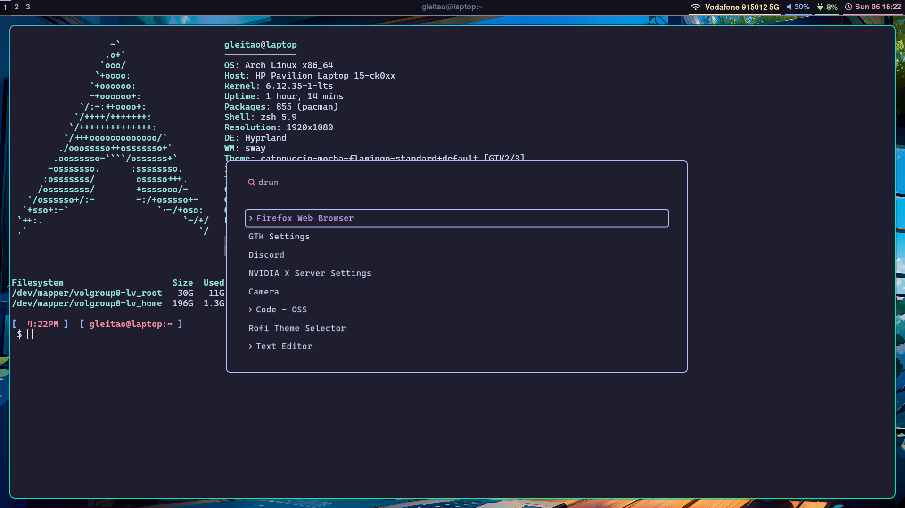

# 🖥 OS setup

One-command, idempotent bootstraps for fresh installs. Each subdirectory
contains a `setup.sh`, a `.zshrc`, and any companion config files (stow
packages, theme overrides, etc.).

> ⬆️ For the repository overview, see the [root README](../README.md).

---

## 📦 Available setups

| OS                                              | Highlights                                                                                                   |
| ----------------------------------------------- | ------------------------------------------------------------------------------------------------------------ |
| **[Arch Linux](./arch/README.md)**              | Full Hyprland desktop, Catppuccin theme, kitty / waybar / wofi / hyprlock, GNU stow-based dotfile management. |
| **[Ubuntu / WSL](./ubuntu/README.md)**          | Minimal headless / WSL setup: zsh + Oh My Zsh + autosuggestions + syntax highlighting + fastfetch.            |

Pick the README that matches the box you're on for full instructions and the
list of flags each `setup.sh` accepts.

---

## 🛠 Common conventions

Both setups share a few design choices, so you don't have to relearn them
between OSes:

- **Idempotent.** Re-running `setup.sh` won't break anything — it skips work
  that's already done and backs up real files before replacing them with
  symlinks.
- **Single sudo prompt.** Each script caches your sudo credentials once at the
  start and keeps them alive until it finishes.
- **`.zshrc` backups.** If you already have a `~/.zshrc` that differs from the
  shipped one, it's copied to `~/.zshrc.backup.<timestamp>` before being
  overwritten.
- **`--filesystems` / `--no-disk-info` flags.** The bundled `.zshrc` prints a
  `df -h` summary at every shell start. Both scripts accept the same flags to
  override the device paths or strip the block entirely.
- **`scripts/` on `PATH`.** Both bundled `.zshrc` files add
  `~/dotfiles/scripts` to your `PATH`, so utility scripts in
  [../scripts/](../scripts/README.md) are callable by name from anywhere.

---

## 🖼 Screenshot

The Arch + Hyprland setup looks like this:

